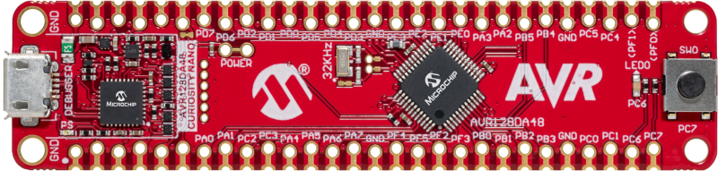
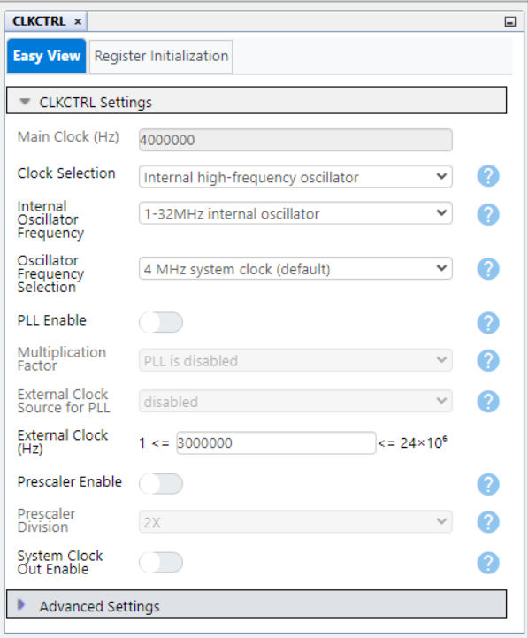
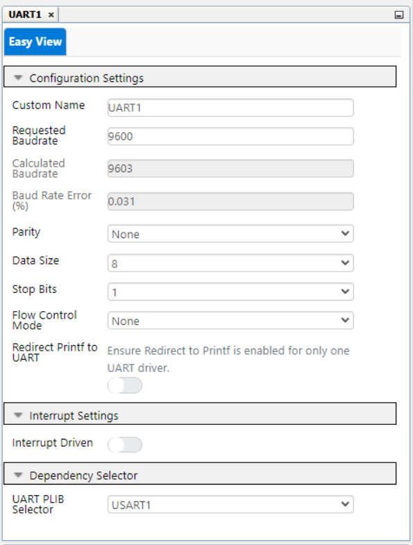
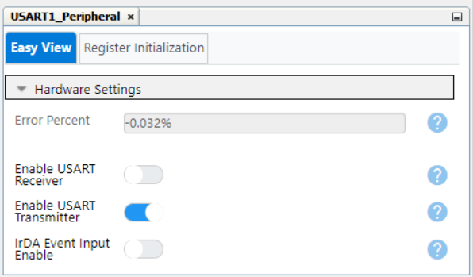
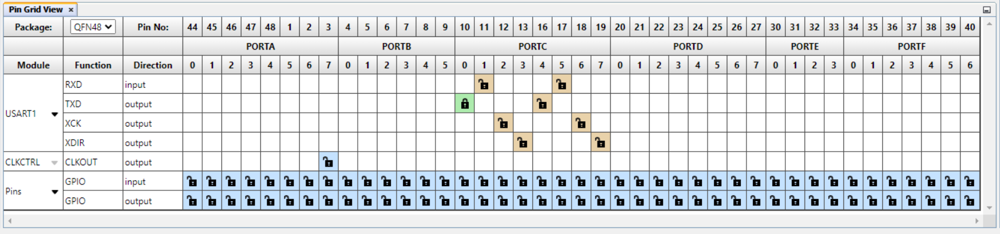
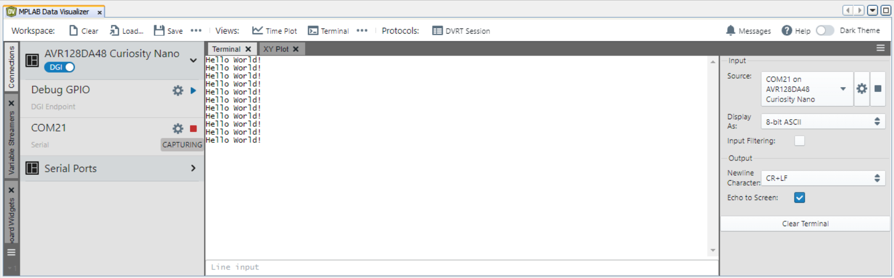
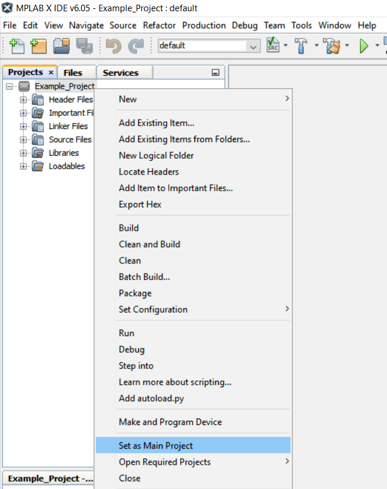
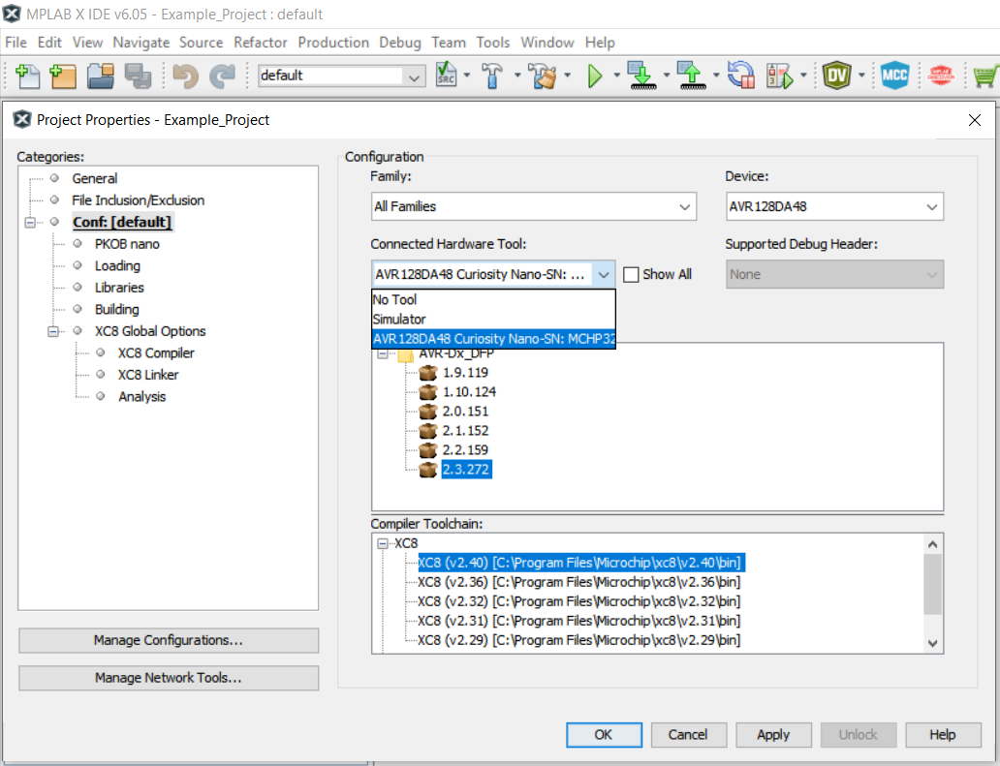

 # Sending "Hello World" Message via USART using the AVR128DA48 Microcontroller with MCC Melody

 This repository provides an MCC Melody-generated code example for a basic USART communication using the MPLAB® X project.

 This example demonstrates the basic functionality of the USART peripheral. The message "Hello world!" is sent through TX (PC0) pin every second and can be viewed using a terminal on a PC.

## Related Documentation

More details and code examples on the AVR128DA48 can be found at the following links:
- [Getting Started with Universal Synchronous and Asynchronous Receiver and Transmitter (USART)](https://www.microchip.com/en-us/application-notes/tb3216)
- [AVR128DA48 Product Page](https://www.microchip.com/wwwproducts/en/AVR128DA28)
- [AVR128DA48 Code Examples on GitHub](https://github.com/microchip-pic-avr-examples?q=avr128da48)

## Software Used

- [MPLAB® X IDE v6.05 or newer](http://www.microchip.com/mplab/mplab-x-ide)
- [MPLAB® XC8 2.40 or newer](http://www.microchip.com/mplab/compilers)
- [MPLAB® Data Visualizer](https://www.microchip.com/en-us/tools-resources/debug/mplab-data-visualizer)
- [AVR-Dx v2.2.159 Device Family Pack or newer](https://packs.download.microchip.com/)

## Hardware Used

- AVR128DA48 Curiosity Nano Development Board is used as a test platform. [(DM164151)](https://www.microchip.com/Developmenttools/ProductDetails/DM164151)
 

## Operation

To program the Curiosity Nano board with this MPLAB® X project, follow the steps provided in the [How to Program the Curiosity Nano Board](#how-to-program-the-curiosity-nano-board) chapter.  

## 1. Setup

The following peripheral and clock configurations are set up using MCC Melody for the AVR128DA48:

- Clock Control:
  - Default settings (Main Clock: 4 MHz)
   

- UART1:
  - UART PLIB Selector: USART1
  - Requested Baudrate: 9600
  - Parity: None
  - Data Size: 8
  - Stop Bits: 1
   

- USART1_Peripheral:
  - Enable USART Transmitter: Enabled
   

- Pin Grid View:
    - USART1 TX: PC0 pin (CDC pin)
   

The following pin configuration must be made for this project:

|  Pin  |    Configuration    |      Function       |
| :---: | :-----------------: | :-----------------: |
|  PC0  | Digital Output      | USART1 TX           |

## 2. Demo

In this demo, the message `Hello World!` is sent via serial communication every second. MPLAB X Data Visualizer is used as a terminal to see the output message.
 

## 3. Summary
This example represents a basic functionality of the USART peripheral. The message "Hello world!" is sent through TX (PC0) pin every second. MPLAB X Data Visualizer displays the "Hello World!" messages on the PC.

##  How to Program the Curiosity Nano board

This chapter shows how to use the MPLAB X IDE to program an AVR® device with an Example_Project.X. This can be applied for any other projects. 

- Connect the board to the PC.

- Open the Example_Project.X project in MPLAB X IDE.

- Set the Example_Project.X project as main project.

  - Right click on the project in the **Projects** tab and click **Set as Main Project**.
     

- Clean and build the Example_Project.X project.

  - Right click on the **Example_Project.X** project and select **Clean and Build**.
     

- Select the **AVRxxxxx Curiosity Nano** in the Connected Hardware Tool section of the project settings:

  - Right click on the project and click **Properties**
  - Click on the arrow under the Connected Hardware Tool
  - Select the **AVRxxxxx Curiosity Nano** (click on the **SN**), click **Apply** and then click **OK**:
     

- Program the project to the board.
  - Right click on the project and click **Make and Program Device**.
     

 

- [Back to Setup](#1-setup)
- [Back to Demo](#2-demo)
- [Back to Summary](#3-summary) 
- [Back to Top](#sending-hello-world-message-via-usart-using-the-avr128da48-microcontroller-with-mcc-melody)