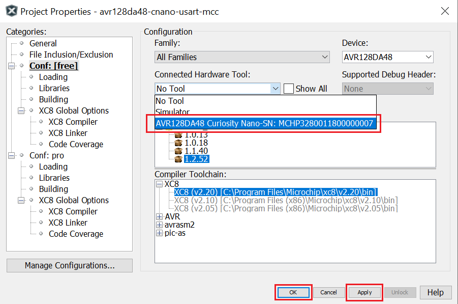
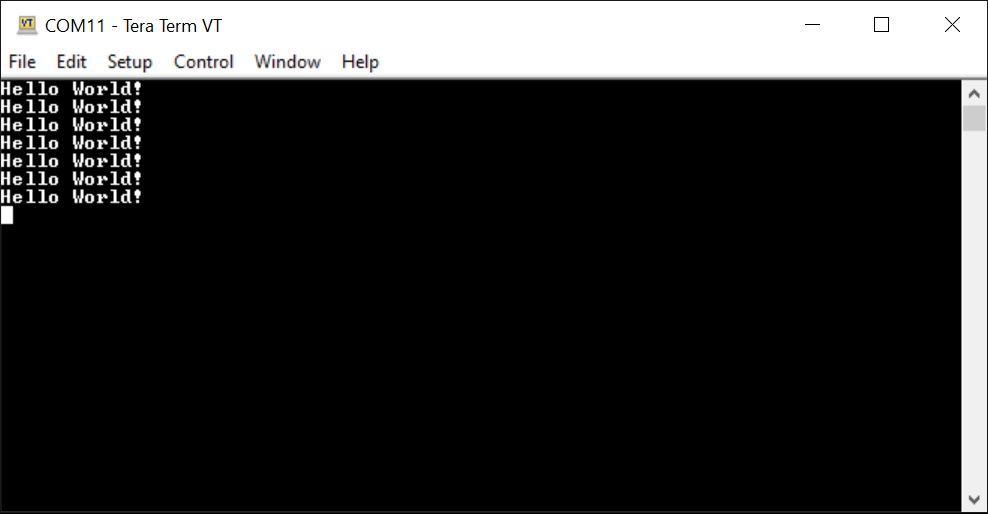

 # AVR128DA48 USART "Hello World!" Code Example

 This repository provides an MPLAB® X project with a MCC Generated code example for a basic USART communication.
 This example demonstrates the basic functionality of the USART peripheral. The message "Hello world!" is sent through TXd (PC0) pin every one second and can be viewed using a terminal on a PC.

## Related Documentation
More details and code examples on the AVR128DA48 can be found at the following links:
- [AVR128DA48 Product Page](https://www.microchip.com/wwwproducts/en/AVR128DA28)
- [AVR128DA48 Code Examples on GitHub](https://github.com/microchip-pic-avr-examples?q=avr128da48)
- [AVR128DA48 Project Examples in START](https://start.atmel.com/#examples/AVR128DA48CuriosityNano)

## Software Used
- MPLAB® X IDE 5.45 or newer [(microchip.com/mplab/mplab-x-ide)](http://www.microchip.com/mplab/mplab-x-ide)
- MPLAB® XC8 2.31 or a newer compiler [(microchip.com/mplab/compilers)](http://www.microchip.com/mplab/compilers)
- MPLAB® Code Configurator (MCC) 4.1.0 or newer [(microchip.com/mplab/mplab-code-configurator)](https://www.microchip.com/mplab/mplab-code-configurator)
- MPLAB® Code Configurator Library 1.37.9 or newer [(microchip.com/mplab/mplab-code-configurator)](https://www.microchip.com/mplab/mplab-code-configurator)
- AVR-Dx 1.6.88 or newer Device Pack

## Hardware Used
- AVR128DA48 Curiosity Nano [(DM164151)](https://www.microchip.com/Developmenttools/ProductDetails/DM164151)

## Setup
The AVR128DA48 Curiosity Nano Development Board is used as test platform
 

The following configurations must be made for this project:

Clock: default

USART1:
  - Mode: Async Mode
  - Baud rate 9600
  - USART Transmitter enabled
  - Parity Mode: No Parity
  - Stop Bit Mode: 1 stop bit
  - Character Size: 8 bit
  

|Pin           | Configuration      |
| :----------: | :----------------: |
|PC0 (TXd)     | Digital Output     |

## Operation
1. Connect the board to the PC.

2. Open the *avr128da48-cnano-usart-mcc.X* project in MPLAB® X IDE.

3. Set *avr128da48-cnano-usart-mcc.X* project as main project. Right click on the project in the *Projects* tab and click *Set as Main Project*.

4. Select the *AVR128DA28 Curiosity Nano* in the *Connected Hardware Tool* section of the project settings:
  - Right click on the project and click *Properties*;
  - Click on the arrow right next to *Connected Hardware Tool*;
  - Select the *AVR128DA28 Curiosity Nano* (click on the SN), click *Apply* and then click *OK*:
 

5. Program the project to the board: right click on the project and click *Make and Program Device*.

Demo:
 

## Summary
This example represents a basic functionality of the USART peripheral. The message "Hello world!" is sent through TXd (PC0) pin every one second and can be viewed using a terminal on a PC.
